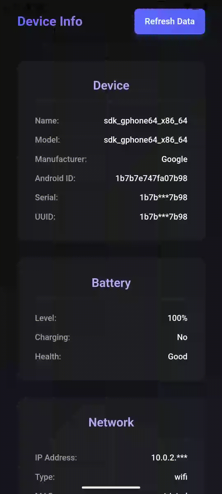
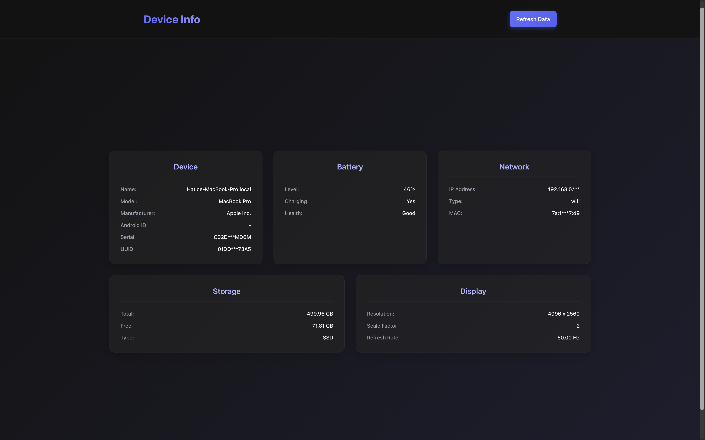
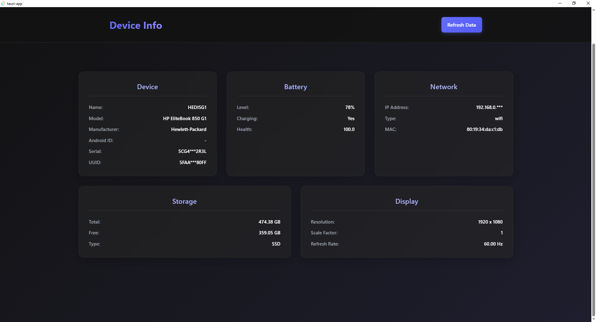
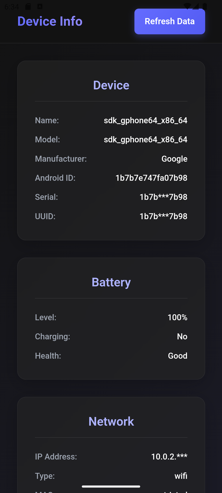
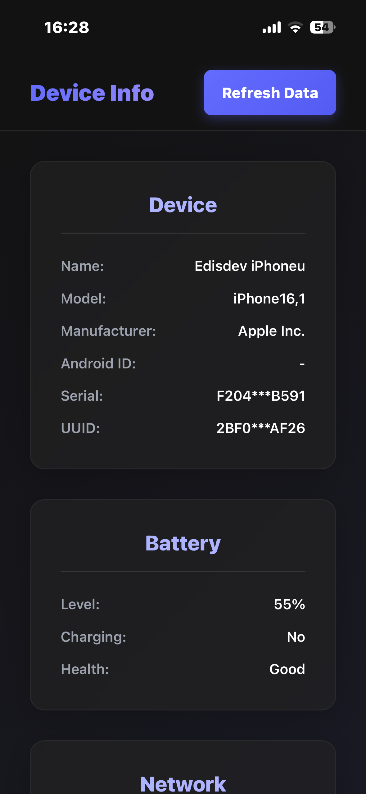

# Tauri Plugin device-info

[](https://www.npmjs.com/package/tauri-plugin-device-info-api)
[](https://www.npmjs.com/package/tauri-plugin-device-info-api)
[](https://crates.io/crates/tauri-plugin-device-info)
[](https://crates.io/crates/tauri-plugin-device-info)
[](https://github.com/edisdev/tauri-plugin-device-info)
[](https://github.com/edisdev/tauri-plugin-device-info/fork)
[](LICENSE)
[](https://tauri.app)
[](https://github.com/edisdev/tauri-plugin-device-info/actions/workflows/build.yml)
[](https://github.com/edisdev/tauri-plugin-device-info/actions/workflows/test.yml)

A comprehensive Tauri plugin to access device information including Battery, Network, Storage, Display, and System Details.

> **One plugin, five data sources, five platforms.** Get battery, network, storage, display, and device identity through a single typed API — on Windows, macOS, Linux, iOS, and Android.

---

**📖 [Read the Documentation](https://edisdev.github.io/tauri-plugin-device-info)**

## ✨ Features

- 🔋 **Battery** — charge level, charging state, and health
- 🌐 **Network** — local IP, connection type, and MAC address
- 💾 **Storage** — total/free space and storage type
- 🖥️ **Display** — resolution, scale factor, and refresh rate
- 🆔 **Device** — manufacturer, model, serial, and device name
- 🔔 **Reactive** — `watch*` APIs push updates on change (native event-driven on macOS, polling fallback elsewhere)
- 📱 **Truly cross-platform** — Windows, macOS, Linux, iOS, and Android
- 🛡️ **Type-safe** — full TypeScript types and granular Tauri permissions
- ✅ **Tested** — unit-tested core with CI across all desktop platforms

## 📸 Preview

<div>
  
  <br>
  
  
  <br>
  
  
  <p><i>Example Dashboard Application across platforms</i></p>
</div>

## Platform Support

| Platform | Support |
| -------- | ------- |
| Windows  | ✅      |
| macOS    | ✅      |
| Linux    | ✅      |
| iOS      | ✅      |
| Android  | ✅      |

## Installation

### Using Tauri CLI (Recommended)

```bash
npm run tauri add device-info
# or
yarn tauri add device-info
```

### Manual Installation

**Cargo.toml:** [](https://crates.io/crates/tauri-plugin-device-info)

```toml
[dependencies]
tauri-plugin-device-info = "1.0"  # Check crates.io for latest version
# or from git
tauri-plugin-device-info = { git = "https://github.com/edisdev/tauri-plugin-device-info" }
```

**package.json:** [](https://www.npmjs.com/package/tauri-plugin-device-info-api)

```json
{
  "dependencies": {
    "tauri-plugin-device-info-api": "^1.0.0"
  }
}
```

## Setup

Register the plugin in your Tauri app:

**src-tauri/src/lib.rs:**

```rust
fn main() {
    tauri::Builder::default()
        .plugin(tauri_plugin_device_info::init())
        .run(tauri::generate_context!())
        .expect("error while running tauri application");
}
```

## Usage

```typescript
import {
  getDeviceInfo,
  getBatteryInfo,
  getNetworkInfo,
  getStorageInfo,
  getDisplayInfo,
} from "tauri-plugin-device-info-api";

// Get device information
const device = await getDeviceInfo();
console.log(device);
```

**Response:**

```json
{
  "uuid": "550e8400-e29b-41d4-a716-446655440000",
  "manufacturer": "Apple Inc.",
  "model": "MacBookPro16,1",
  "serial": "C02XG2JHJG5H",
  "android_id": null,
  "device_name": "John's MacBook Pro"
}
```

```typescript
// Get battery status
const battery = await getBatteryInfo();
console.log(battery);
```

**Response:**

```json
{
  "level": 85,
  "isCharging": true,
  "health": "Good"
}
```

```typescript
// Get network information
const network = await getNetworkInfo();
console.log(network);
```

**Response:**

```json
{
  "ipAddress": "192.168.x.x",
  "networkType": "wifi",
  "macAddress": "a1:b2:c3:d4:e5:f6"
}
```

```typescript
// Get storage information
const storage = await getStorageInfo();
console.log(storage);
```

**Response:**

```json
{
  "totalSpace": 500107862016,
  "freeSpace": 125026965504,
  "storageType": "SSD"
}
```

```typescript
// Get display information
const display = await getDisplayInfo();
console.log(display);
```

**Response:**

```json
{
  "width": 2560,
  "height": 1600,
  "scaleFactor": 2.0,
  "refreshRate": 120
}
```

### Reactive Watch API

Subscribe to a kind and get a callback whenever the value changes, instead of
polling a getter yourself. The current value is delivered immediately, then on
every change. On macOS these are native and event-driven (IOKit / Core Graphics
/ SystemConfiguration); elsewhere they fall back to change-detecting polling.

```typescript
import {
  watchBattery,
  watchNetwork,
  watchStorage,
  watchDisplay,
  watchDevice,
} from "tauri-plugin-device-info-api";
import type { UnwatchFn } from "tauri-plugin-device-info-api";

// Called immediately with the current value, then on every change.
const unwatch = await watchBattery((battery) => {
  console.log(`Battery: ${battery.level}% (charging: ${battery.isCharging})`);
});

// Stop watching and remove the listener when you're done.
await unwatch();
```

Cleaning up several watchers at once (e.g. on component teardown):

```typescript
const unwatchers: UnwatchFn[] = [];
unwatchers.push(await watchNetwork((info) => console.log(info.networkType)));
unwatchers.push(await watchDisplay((info) => console.log(info.width, info.height)));

// Later:
await Promise.all(unwatchers.map((unwatch) => unwatch()));
```

`watch*` accepts an optional `{ intervalMs }` that applies **only to polled
kinds** (native kinds ignore it). Defaults and minimums are per kind: `device`
defaults to 60000 ms (floored at 10000 ms), `storage` to 10000 ms (floored at
1000 ms), and others to 2000 ms (floored at 250 ms). Subscribers to the same
kind share one monitor, so only the first subscriber's interval takes effect.

## API Reference

### getDeviceInfo()

Returns device identification and hardware information.

| Field          | Type      | Description                                  |
| -------------- | --------- | -------------------------------------------- |
| `uuid`         | `string?` | Unique device identifier                     |
| `manufacturer` | `string?` | Device manufacturer (e.g., "Apple Inc.")     |
| `model`        | `string?` | Device model (e.g., "MacBookPro16,1")        |
| `serial`       | `string?` | Serial number (restricted on some platforms) |
| `android_id`   | `string?` | Android-specific ID (Android only)           |
| `device_name`  | `string?` | User-assigned device name                    |

### getBatteryInfo()

Returns battery status and health information.

| Field        | Type       | Description                    |
| ------------ | ---------- | ------------------------------ |
| `level`      | `number?`  | Battery percentage (0-100)     |
| `isCharging` | `boolean?` | Whether the device is charging |
| `health`     | `string?`  | Battery health status          |

### getNetworkInfo()

Returns network connection details.

| Field         | Type      | Description                                                |
| ------------- | --------- | ---------------------------------------------------------- |
| `ipAddress`   | `string?` | Local IP address                                           |
| `networkType` | `string?` | Connection type: "wifi", "cellular", "ethernet", "unknown" |
| `macAddress`  | `string?` | MAC address (unavailable on iOS/Android due to privacy)    |

### getStorageInfo()

Returns storage capacity information.

| Field         | Type      | Description                            |
| ------------- | --------- | -------------------------------------- |
| `totalSpace`  | `number?` | Total storage in bytes                 |
| `freeSpace`   | `number?` | Available storage in bytes             |
| `storageType` | `string?` | Storage type: "SSD", "HDD", "internal" |

### getDisplayInfo()

Returns display/screen information.

| Field         | Type      | Description                                 |
| ------------- | --------- | ------------------------------------------- |
| `width`       | `number?` | Screen width in pixels                      |
| `height`      | `number?` | Screen height in pixels                     |
| `scaleFactor` | `number?` | Display scale factor (e.g., 2.0 for Retina) |
| `refreshRate` | `number?` | Screen refresh rate in Hz                   |

### watch\*(callback, options?)

Subscribes to a kind and invokes `callback` with the current value immediately,
then on every change. Returns a `Promise<UnwatchFn>`; call the returned function
to stop watching and remove the listener.

| Function | Callback payload |
| ----------------- | -------------------- |
| `watchDevice()`   | `DeviceInfoResponse` |
| `watchBattery()`  | `BatteryInfo`        |
| `watchNetwork()`  | `NetworkInfo`        |
| `watchStorage()`  | `StorageInfo`        |
| `watchDisplay()`  | `DisplayInfo`        |

**Options**

| Field        | Type      | Description                                                                                   |
| ------------ | --------- | -------------------------------------------------------------------------------------------- |
| `intervalMs` | `number?` | Polling interval for polled kinds only (native kinds ignore it). Per-kind defaults/minimums. |

## TypeScript Types

All types are exported and can be imported:

```typescript
import type {
  DeviceInfoResponse,
  BatteryInfo,
  NetworkInfo,
  StorageInfo,
  DisplayInfo,
  WatchOptions,
  UnwatchFn,
} from "tauri-plugin-device-info-api";
```

## Permissions

Add the required permissions in your `capabilities` configuration.

**src-tauri/capabilities/default.json:**

```json
{
  "$schema": "../gen/schemas/desktop-schema.json",
  "identifier": "default",
  "description": "Capability for the main window",
  "windows": ["main"],
  "permissions": ["core:default", "device-info:default"]
}
```

### Available Permissions

| Permission                           | Description                       |
| ------------------------------------ | --------------------------------- |
| `device-info:default`                | Enables all device-info commands  |
| `device-info:allow-get-device-info`  | Allows getting device information |
| `device-info:allow-get-battery-info` | Allows getting battery status     |
| `device-info:allow-get-network-info` | Allows getting network details    |
| `device-info:allow-get-storage-info` | Allows getting storage info       |
| `device-info:allow-get-display-info` | Allows getting display info       |
| `device-info:allow-start-watching`   | Allows starting a reactive watch  |
| `device-info:allow-stop-watching`    | Allows stopping a reactive watch  |

### Individual Permissions Example

If you want to grant only specific permissions:

```json
{
  "$schema": "../gen/schemas/desktop-schema.json",
  "identifier": "default",
  "description": "Capability for the main window",
  "windows": ["main"],
  "permissions": [
    "core:default",
    "device-info:allow-get-battery-info",
    "device-info:allow-get-network-info"
  ]
}
```

## Platform-Specific Notes

### iOS

- MAC address is not available due to Apple's privacy restrictions (returns "unavailable")
- Serial number uses a persistent Keychain-stored UUID

### Android

- MAC address is restricted on Android 6.0+ (returns "restricted")
- Requires no special permissions for basic device info

### macOS

- Uses native CoreGraphics API for accurate refresh rate detection
- Full access to all device information

### Windows

- Uses WMI (Windows Management Instrumentation) for device info
- Full access to all device information

### Linux

- Display refresh rate requires X11 (xrandr)
- Device info read from `/sys/class/dmi/id/`

## Testing

The Rust core is covered by unit tests that run on every push and pull request
via GitHub Actions across Linux, macOS, and Windows (see the **Tests** badge above).

```bash
# Run the Rust test suite
cargo test

# Lint and formatting (same checks as CI)
cargo fmt -- --check
cargo clippy -- -D warnings

# JavaScript type check
yarn tsc --noEmit
```

## Changelog

See [CHANGELOG.md](CHANGELOG.md) for the release history and notable changes.

## Contributing

Contributions are welcome! Please read the [Contributing Guide](CONTRIBUTING.md)
and the [Code of Conduct](CODE_OF_CONDUCT.md) before opening a pull request.

## License

MIT

